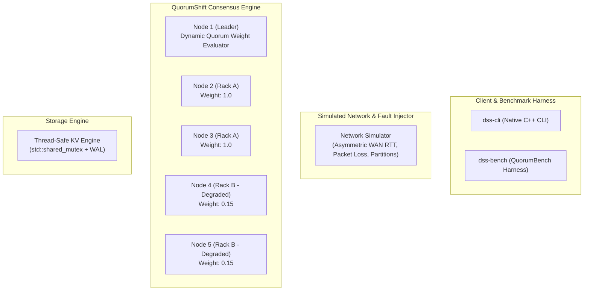

# QuorumShift (`quorumshift`)

> A high-performance C++20 distributed storage engine and research prototype evaluating failure-domain-aware adaptive Raft consensus (**QuorumShift**).

---

## 🏛 Architecture

---

## 🔬 Research & Benchmark (`QuorumShift`)

See [`RESEARCH.md`](RESEARCH.md) for full research documentation, literature review, novelty analysis, experimental benchmark metrics, and manuscript sources.

- **Primary Research Paper**: [`research/paper/main.tex`](research/paper/main.tex)
- **Experimental Protocol**: [`research/EXPERIMENT_PROTOCOL.md`](research/EXPERIMENT_PROTOCOL.md)
- **Literature Review**: [`research/literature-review.md`](research/literature-review.md)

---

## Author

**Sham Satish Thakare**  
GitHub: [https://github.com/shamddd](https://github.com/shamddd)
