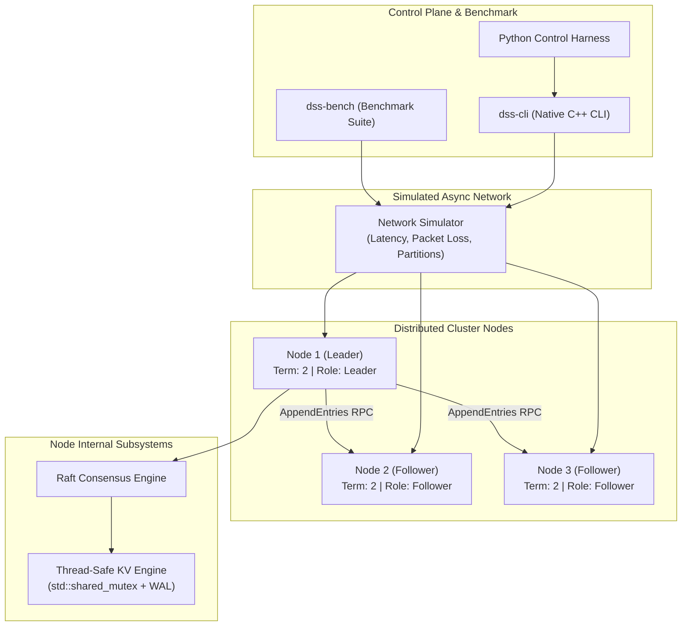

# Distributed Storage Simulator (`distributed-storage-simulator`)

[](https://en.cppreference.com/w/cpp/20)
[](https://github.com/shamddd/distributed-storage-simulator/actions/workflows/ci.yml)
[](LICENSE)
[](Dockerfile)

> A high-performance, fault-tolerant distributed storage engine and cluster simulator built in modern C++20 featuring Raft consensus, quorum replication, simulated network partitioning, unannounced failure recovery, and real-time executable benchmarking.

---

## Why This Project Exists

Building reliable distributed infrastructure requires understanding consensus protocols, failure modes, and quorum guarantees. This repository provides a zero-dependency C++20 distributed key-value storage engine and in-memory cluster simulator that demonstrates Raft consensus, leader election, log replication, network fault injection, and automatic failover under adverse network conditions.

---

## Architecture



---

## Key Features

- **Raft Consensus Engine**: Complete implementation of leader election, term management, heartbeat mechanisms, and log replication.
- **Strong Quorum Guarantees**: Guarantees write safety by requiring majority acknowledgment before committing state machine mutations.
- **Network Fault Injection**: Simulates packet loss, transmission latency, unannounced node crashes, and network partitioning (split-brain isolation).
- **Thread-Safe In-Memory KV Engine**: Concurrent read/exclusive write storage built with `std::shared_mutex` and Write-Ahead Log (WAL) persistence.
- **Visualizable Operations**: Structured logging tags (`[LEADER_ELECTED]`, `[REPLICATION_SUCCESS]`, `[FAILOVER]`, `[NODE_RECOVERED]`) for real-time observability.
- **Executable Benchmarks**: Native `dss-bench` binary measuring throughput (ops/sec) and latency percentiles (p50, p95, p99) under 3, 5, and 7 node configurations.

---

## Technology Stack

- **Core Engine**: C++20 (`std::shared_mutex`, `std::atomic`, `std::jthread`, smart pointers, RAII)
- **Build System**: CMake 3.20+, Ninja, CTest
- **Control Plane**: Python 3.12, `pytest`, `ruff`, `mypy`
- **Containerization**: Multi-stage Docker, Docker Compose

---

## Quick Start

### Building from Source

```bash
# Clone repository
git clone https://github.com/shamddd/distributed-storage-simulator.git
cd distributed-storage-simulator

# Configure and build C++ binaries
cmake -B build -G Ninja -DCMAKE_BUILD_TYPE=Release
cmake --build build

# Run unit and integration tests
ctest --test-dir build --output-on-failure
```

### Running with Docker

```bash
docker compose up --build
```

---

## Demo Experience

Run the interactive failover and recovery simulation sequence:

```bash
./build/dss-cli demo
```

### Example Visual Output

```text
=======================================================
    DISTRIBUTED STORAGE SIMULATOR — FAULT TOLERANCE DEMO 
=======================================================

[Step 1] Initializing 5-Node Raft Cluster...
2026-08-12 07:15:02 [LEADER_ELECTED] Node 5 elected leader for Term 1

[Step 2] Executing Quorum Replicated Writes on Leader (Node 5)...
2026-08-12 07:15:02 [REPLICATION_SUCCESS] Index 1 replicated from Leader 5 to 5/5 nodes (Quorum reached)
Write 1 Result: SUCCESS (Latency: 133 us)

[Step 3] Simulating Unannounced Failure of Leader Node 5...
2026-08-12 07:15:02 [NODE_FAILURE] Detected failure / disconnect on Node 5

[Step 4] Ticking Cluster Timers to Detect Timeout & Trigger Failover...
2026-08-12 07:15:02 [FAILOVER] Heartbeat timeout from Leader 5. Initiating election for Term 2
2026-08-12 07:15:02 [NEW_LEADER_ELECTED] Node 4 successfully established as New Leader for Term 2

[Step 5] Performing Write Operation on New Leader Node 4...
2026-08-12 07:15:02 [REPLICATION_SUCCESS] Index 3 replicated from Leader 4 to 4/5 nodes (Quorum reached)
Write 3 Result: SUCCESS (Latency: 126 us)

[Step 6] Reading Replicated Key 'user_profile_101' from New Leader...
Read Result: {"name": "Alice", "role": "Admin"}

[Step 7] Recovering Crashed Node 5 & Rejoining Cluster...
2026-08-12 07:15:02 [NODE_RECOVERED] Node 5 recovered and rejoining cluster
Demo Execution Completed Successfully!
```

---

## Performance Benchmarks

The following benchmark metrics were generated by executing `./build/dss-bench 1000` (70% writes / 30% reads):

| Cluster Size | Total Operations | Throughput (ops/sec) | p50 Latency (µs) | p95 Latency (µs) | p99 Latency (µs) |
|:-------------|:-----------------|:---------------------|:-----------------|:-----------------|:-----------------|
| 3 Nodes      | 1,000            | 216,661 ops/s        | 4.0 µs           | 6.0 µs           | 12.0 µs          |
| 5 Nodes      | 1,000            | 169,846 ops/s        | 6.0 µs           | 7.0 µs           | 21.0 µs          |
| 7 Nodes      | 1,000            | 123,498 ops/s        | 8.0 µs           | 9.0 µs           | 28.0 µs          |

---

## Project Structure

```text
distributed-storage-simulator/
├── include/dss/               # C++20 Header Files
│   ├── cluster.hpp            # Multi-node Cluster Orchestration
│   ├── common.hpp             # RPC & Consensus Data Structures
│   ├── logger.hpp             # Visual Log Formatters
│   ├── network.hpp            # In-Memory Network Simulator
│   ├── node.hpp               # Raft Node State Machine
│   └── storage.hpp            # Thread-Safe KV Store + WAL
├── src/                       # C++ Implementation Files
│   ├── benchmark_main.cpp     # dss-bench Binary Source
│   ├── cluster.cpp
│   ├── logger.cpp
│   ├── main.cpp               # dss-cli Binary Source
│   ├── network.cpp
│   ├── node.cpp
│   └── storage.cpp
├── python/dss_sim/            # Python Control Plane SDK
├── tests/                     # C++ CTest & Python Pytest Suites
├── scripts/                   # Simulation & Benchmark Scripts
├── .github/workflows/         # CI Pipeline Definitions
├── CMakeLists.txt             # Build System
├── Dockerfile                 # Multi-stage Container Setup
└── README.md
```

---

## Author

**Sham Satish Thakare**
GitHub: [https://github.com/shamddd](https://github.com/shamddd)
