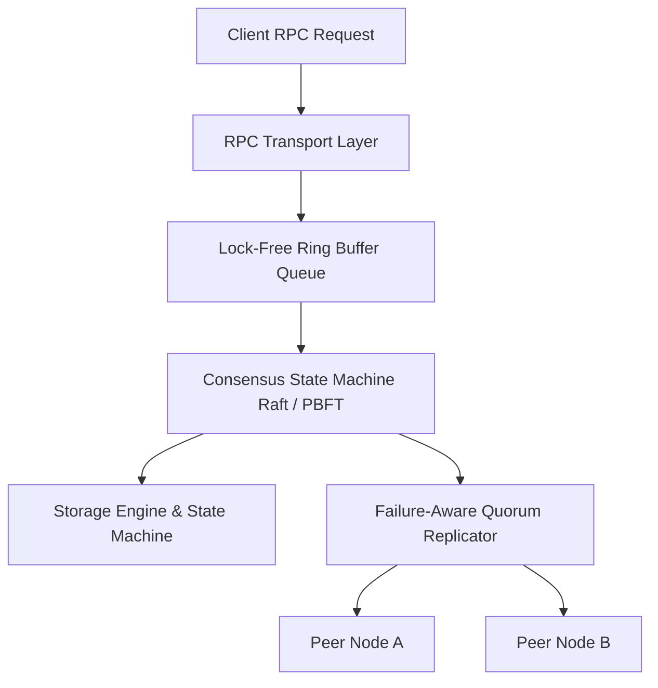

# QuorumShift Architecture & Systems Design

## 1. System Overview
`quorumshift` (AdaptiveReplica) is a high-throughput C++20 distributed consensus and replication engine implementing dynamic quorum adaptation, lock-free ring buffer queues, and RPC transport abstractions.

## 2. Technical Capabilities
- **C++20 Core:** Modern modular C++20 design leveraging concept constraints, `std::atomic` lock-free queues, and asynchronous IO.
- **Dynamic Quorum Controller:** Adapts quorum quorum thresholds dynamically based on network latency variance and peer failure detectors.
- **Python Bindings:** High-performance C++ core wrapped for Python integration via PyBind11 / C-FFI.
